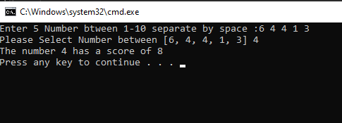

# Prework-CodeChallenges

## Array Max Result

[Code](Prework-CodeChallenges/ArrayMaxResult/Program.cs)

#### Output :

## Leap Year Calculator

[Code](Prework-CodeChallenges/LeapYearCalculator/Program.cs)

#### Output :

## Perfect Sequence

[Code](Prework-CodeChallenges/PerfectSequence/Program.cs)

#### Output :

## Sum of Rows

[Code](Prework-CodeChallenges/SumOfRows/Program.cs)

#### Output :

